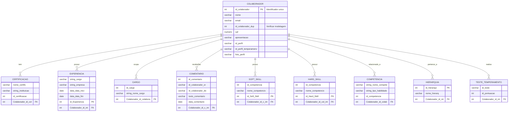

# 📄 Estrutura da Documentação do Banco de Dados

## 1. Visão Geral e Tecnologia 💡

* **Objetivo do Banco de Dados:** Gerenciar dados relacionados a **Colaboradores** (funcionários ou membros da equipe), incluindo suas competências, experiências, certificações, cargos e avaliações internas (comentários, testes de temperamento e hierarquia).
* **Tecnologia Utilizada:**
    * **SGBD:** **MySQL**
    * **Hospedagem:** **Railway** (Para detalhes de conexão, consulte a Seção 5).

---

## 2. Modelo de Dados e Entidades 🧩

* O banco de dados segue um **modelo relacional**, fundamentado em uma entidade principal (`COLABORADOR`) e entidades acessórias que detalham seus atributos.
* **Principais Entidades (Tabelas):**
    * **`COLABORADOR`**: A entidade central, contendo os dados pessoais.
    * **Detalhes Profissionais**: `CERTIFICACAO`, `EXPERIENCIA`, `Cargo`.
    * **Habilidades**: `Soft_Skill`, `Hard_Skill`, `COMPETENCIA`.
    * **Avaliação e Organização**: `Comentario`, `Hierarquia`, `teste_temperamento`.

---

## 3. Estrutura Detalhada das Entidades (Tabelas) 📋

A seguir, a descrição detalhada de cada tabela, incluindo colunas, tipos de dados e restrições.

### 3.1. Tabela: COLABORADOR (Entidade Principal)

Esta tabela armazena os dados cadastrais básicos de cada colaborador.

| Coluna | Tipo de Dados | Chave/Restrição | Descrição |
| :--- | :--- | :--- | :--- |
| `id_colaborador` | `int` | **PK** | **Identificador único do colaborador.** |
| `nome` | `varchar(60)` | - | Nome completo do colaborador. |
| `email` | `varchar(60)` | - | E-mail do colaborador. |
| `id_colaborador` | `int` | - | Identificador adicional (Verificar a modelagem). |
| `cpf` | `numeric(10,10)` | - | CPF do colaborador. |
| `apresentacao` | `varchar(100)` | - | Uma breve apresentação ou resumo. |
| `id_perfil` | `varchar(100)` | - | Perfil de acesso/sistema. |
| `id_perfil_temperamenv` | `varchar(100)` | - | Resultado do perfil de temperamento. |
| `foto_perfil` | `varchar(255)` | - | URL ou caminho para a foto de perfil. |

### 3.2. Tabela: CERTIFICACAO

| Coluna | Tipo de Dados | Chave/Restrição | Descrição |
| :--- | :--- | :--- | :--- |
| `nome_certific` | `varchar(60)` | - | Nome da certificação obtida. |
| `string_instituicao` | `varchar(60)` | - | Instituição que emitiu a certificação. |
| `id_certificacao` | `int` | - | Identificador da certificação. |
| `Colaborador_id_col` | `int` | **FK** | Chave estrangeira ligando ao Colaborador. |

### 3.3. Tabela: EXPERIENCIA

| Coluna | Tipo de Dados | Chave/Restrição | Descrição |
| :--- | :--- | :--- | :--- |
| `string_cargo` | `varchar(60)` | - | Cargo ocupado na experiência. |
| `string_empresa` | `varchar(60)` | - | Nome da empresa onde a experiência ocorreu. |
| `data_data_inici` | `date` | - | Data de início da experiência. |
| `data_data_fim` | `date` | - | Data de fim da experiência. |
| `id_Experiencia` | `int` | **PK** | **Identificador único da experiência.** |
| `Colaborador_id_int` | `int` | **FK** | Chave estrangeira ligando ao Colaborador. |

### 3.4. Tabela: Cargo

| Coluna | Tipo de Dados | Chave/Restrição | Descrição |
| :--- | :--- | :--- | :--- |
| `id_cargo` | `int` | - | Identificador do cargo. |
| `string_nome_cargo` | `varchar(60)` | - | Nome do cargo (Ex: Analista, Gerente). |
| `Colaborador_id_colabora` | `int` | **FK** | Chave estrangeira ligando ao Colaborador. |

### 3.5. Tabela: Soft_Skill

| Coluna | Tipo de Dados | Chave/Restrição | Descrição |
| :--- | :--- | :--- | :--- |
| `id_competencia` | `int` | - | Identificador da competência de soft skill. |
| `nome_competenciv` | `varchar(60)` | - | Nome da Soft Skill (Ex: Comunicação, Liderança). |
| `id_Soft_Skill` | `int` | **PK** | **Identificador único da soft skill.** |
| `Colaborador_id_c_int` | `int` | **FK** | Chave estrangeira ligando ao Colaborador. |

### 3.6. Tabela: Hard_Skill

| Coluna | Tipo de Dados | Chave/Restrição | Descrição |
| :--- | :--- | :--- | :--- |
| `id_competencia` | `int` | - | Identificador da competência de hard skill. |
| `nome_competenciv` | `varchar(60)` | - | Nome da Hard Skill (Ex: Java, SQL, Python). |
| `id_Hard_Skill` | `int` | **PK** | **Identificador único da hard skill.** |
| `Colaborador_id_col_int` | `int` | **FK** | Chave estrangeira ligando ao Colaborador. |

### 3.7. Tabela: COMPETENCIA

| Coluna | Tipo de Dados | Chave/Restrição | Descrição |
| :--- | :--- | :--- | :--- |
| `string_nome_compete` | `varchar(60)` | - | Nome da competência. |
| `string_tipo_habilidade` | `varchar(60)` | - | Tipo de habilidade (Ex: Técnica, Comportamental). |
| `id_competencia` | `int` | - | Identificador da competência. |
| `Colaborador_id_colab` | `int` | **FK** | Chave estrangeira ligando ao Colaborador. |

### 3.8. Tabela: Comentario

| Coluna | Tipo de Dados | Chave/Restrição | Descrição |
| :--- | :--- | :--- | :--- |
| `id_comentario` | `int` | - | Identificador do comentário. |
| `id_colaborador_or` | `varchar(100)` | - | ID do colaborador que originou o comentário. |
| `id_colaborador_de` | `varchar(100)` | - | ID do colaborador que está sendo avaliado/comentado. |
| `texto_comentario` | `varchar(500)` | - | Conteúdo textual do comentário. |
| `data_comentario` | `date` | - | Data em que o comentário foi registrado. |
| `Colaborador_id_c_int` | `int` | **FK** | Chave estrangeira ligando ao Colaborador (A quem o comentário se refere). |

### 3.9. Tabela: Hierarquia

| Coluna | Tipo de Dados | Chave/Restrição | Descrição |
| :--- | :--- | :--- | :--- |
| `id_hierarqui` | `int` | **PK** | **Identificador da hierarquia.** |
| `nome_hierarq` | `varchar(100)` | - | Nome do nível hierárquico. |
| `Colaborador_id_int` | `int` | **FK** | Chave estrangeira ligando ao Colaborador (Qual colaborador pertence a este nível). |

### 3.10. Tabela: teste_temperamento

| Coluna | Tipo de Dados | Chave/Restrição | Descrição |
| :--- | :--- | :--- | :--- |
| `id_teste` | `varchar(100)` | - | Identificador do teste. |
| `id_pontuacao` | `int` | - | Pontuação obtida no teste. |
| `Colaborador_id_int` | `int` | **FK** | Chave estrangeira ligando ao Colaborador. |

---

## 4. Relacionamentos entre Entidades (1:N) 🔗

Os relacionamentos definem como as informações estão conectadas. Todos os relacionamentos abaixo são **Um para Muitos (1:N)**, onde um `COLABORADOR` pode ter **Muitos** itens nas tabelas relacionadas.

| Tabela Principal (1) | Tabela Relacionada (N) | Tipo de Relacionamento | Campo de Ligação (FK) |
|:---------------------|:-----------------------|:-----------------------|:----------------------|
| **Colaborador** | Certificacao | 1:N | `Colaborador_id_col` |
| **Colaborador** | Experiencia | 1:N | `Colaborador_id_int` |
| **Colaborador** | Cargo | 1:N | `Colaborador_id_colabora` |
| **Colaborador** | Comentario | 1:N | `Colaborador_id_c_int` |
| **Colaborador** | Soft_Skill | 1:N | `Colaborador_id_c_int` |
| **Colaborador** | Hard_Skill | 1:N | `Colaborador_id_col_int` |
| **Colaborador** | Competencia | 1:N | `Colaborador_id_colab` |
| **Colaborador** | Hierarquia | 1:N | `Colaborador_id_int` |
| **Colaborador** | teste_temperamento | 1:N | `Colaborador_id_int` |

---

## 5. Configuração de Hospedagem (Railway) ⚙️

-   **SGBD:** MySQL
-   **Ambiente:** Nuvem (Railway)
-   **Acesso:** As credenciais de acesso (hostname, porta, nome do banco, usuário e senha) estão disponíveis na aba "Credentials" do serviço de banco de dados no painel do Railway.

